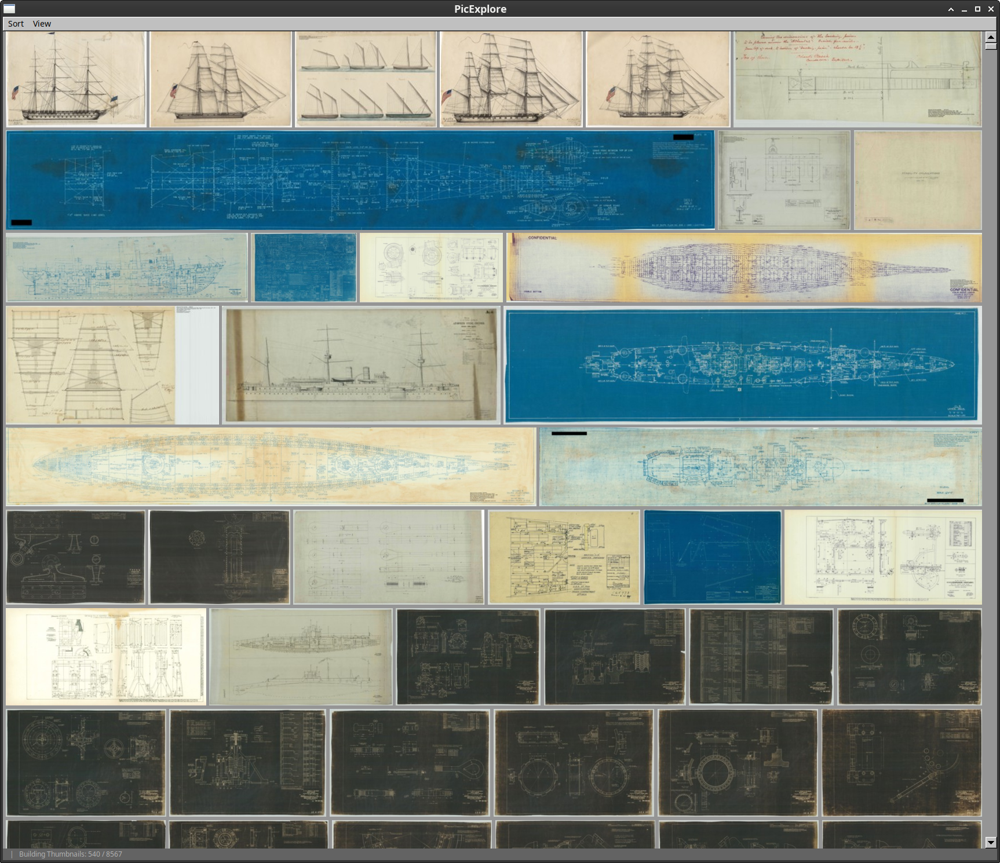
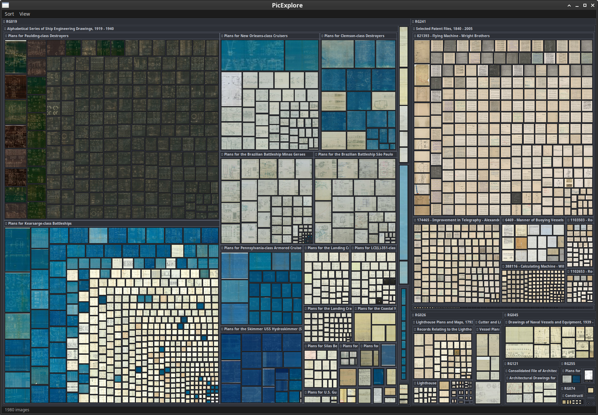
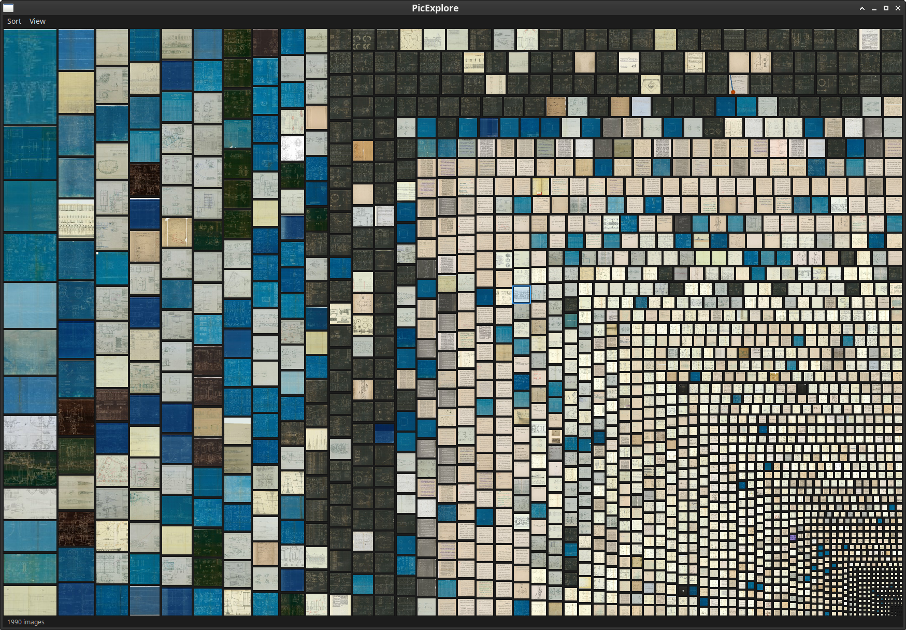
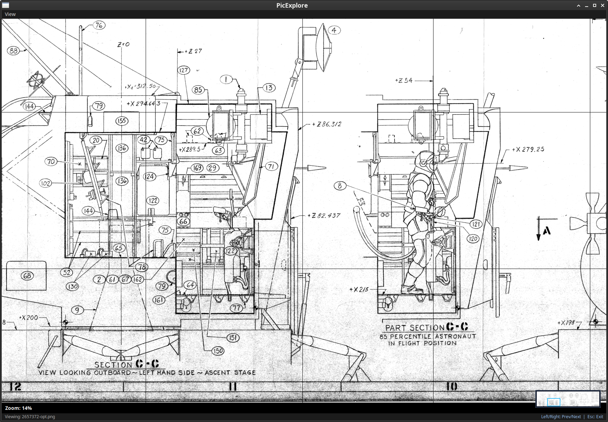

# picexplore


*Justified Grid Layout: fluid, multi-resolution row-based photo gallery.*


*Hierarchical (Nested) Treemap: multi-level directory clustering with depth-themed container frames, folder headers, and square thumbnail mosaics.*


*Flat Squarified Treemap: full-collection thumbnail mosaic proportionally weighted by file size or pixel dimensions.*


*Single-Image Deep Zoom: full-resolution inspection with level-of-detail (LOD) tiling and interactive minimap navigator.*

---

**PicExplore** is a high-performance, lightweight image browser, content-based deduplicator, batch scanner, and PDF gallery generator for local photo collections.

It combines an interactive FLTK GUI featuring Flickr-style justified layouts, flat and hierarchical squarified treemaps, multi-resolution progressive thumbnail streaming, and deep-zoom tiling with high-throughput headless batch tools backed by an embedded LMDB database.

---

## Quick Start

### 1. Interactive GUI Viewer (Default)
Explore and browse an image directory interactively:
```bash
picexplore /path/to/photos
```

### 2. Headless Batch Scanner
Scan an image collection and build or update the thumbnail database without launching the GUI:
```bash
picexplore --scan /path/to/photos
```

### 3. PDF Gallery Generator
Generate a multi-page justified PDF contact sheet directly from a directory or existing database:
```bash
# Scan and export PDF in one command
picexplore -d /path/to/photos --pdf gallery.pdf

# Export PDF from existing database with custom row height and margins
picexplore --pdf gallery.pdf --row-height 180 --margin 12
```

---

## Key Features

- **Triple Interactive Layouts**:
  - **Fluid Justified Grid** (<kbd>Ctrl+1</kbd>): Dynamically arranges photos in clean, aesthetic rows using an optimized justified layout algorithm.
  - **Flat Squarified Treemap** (<kbd>Ctrl+2</kbd>): Visualizes all photos in a flat 2D squarified treemap with zero-allocation $O(1)$ ratio evaluations (<1 ms for 10,000+ items). Proportionally scales rectangles by **File Size** (bytes), **Pixel Area** (megapixels), or **Equal Size**.
  - **Hierarchical (Nested) Treemap** (<kbd>Ctrl+3</kbd>): Recursively clusters images by directory hierarchy into nested subfolder containers with depth-themed border frames and directory labels. Supports **interactive directory drill-down** (click any folder header to zoom in) and **parent directory navigation** (click the top parent bar to navigate back up).
- **Triple Treemap Visual Styles**:
  - **All Thumbnails** *(Default)*: Center-cropped square thumbnail mosaic rendered across all tiles down to 1px.
  - **Cushion Treemap**: 3D shaded cushion treemap based on the classic van Wijk & van de Wetering algorithm, accumulating multi-level parabolic height profiles down the directory tree with real-time Lambertian diffuse lighting.
  - **File Type Colors**: Categorical color-coded cards with file extension badges (JPG, PNG, WebP, GIF, TIFF, BMP, TGA, PDF, SVG) and a live status-bar color key.
- **Progressive Multi-Resolution Streaming**: Generates and loads thumbnails asynchronously across 6 resolution tiers (32px &rarr; 64px &rarr; 128px &rarr; 256px &rarr; 512px &rarr; 1024px), prioritizing visible viewport regions.
- **Deep Zoom & Tiling**: Smooth single-image inspection mode with full-resolution rendering, level-of-detail (LOD) tiling cache, and interactive minimap navigator.
- **Dynamic Mode-Aware Menus**: Contextual Sort and View options adapt automatically to the active view mode (Flat Treemap, Hierarchical Treemap, Grid, or Single Image), eliminating irrelevant controls.
- **Content-Based Deduplication**: Employs xxHash (XXH3 128-bit) content hashing to detect identical images across different folders or filenames without duplicate thumbnail generation.
- **High-Performance LMDB Database**: Fast embedded LMDB storage caches paths, hashes, EXIF metadata, aspect-ratio thumbnails, and pre-cropped square thumbnails (`hash:sq128`, `hash:sq64`) with lock-free parallel read concurrency across all CPU cores.
- **Live Directory Watching**: Automatically detects added, deleted, or modified files in real time (via `inotify` on Linux).
- **Metadata & EXIF Inspector**: Collapsible info panel displaying image dimensions, file size, timestamps, EXIF metadata, duplicate occurrences, and clickable folder breadcrumbs for directory filtering.
- **PDF Contact Sheet Generation**: Vector/raster PDF generator with justified layout, customizable row heights, image spacing, and padding.

---

## GUI Controls & Navigation

| Action | Control | Description |
| :--- | :--- | :--- |
| **Switch to Justified Grid** | `Ctrl` + `1` | Switch to row-based justified photo gallery |
| **Switch to Flat Treemap** | `Ctrl` + `2` | Switch to flat squarified treemap collection view |
| **Switch to Hierarchical Treemap** | `Ctrl` + `3` | Switch to nested directory hierarchy treemap view |
| **Drill Down into Directory** | `Left Click` on folder header | Zoom into specific subdirectory in Hierarchical Treemap |
| **Navigate to Parent Directory** | `Left Click` on top parent bar | Zoom out to parent directory (`Ctrl` + `R` resets to root) |
| **Scroll Gallery** | `Mouse Wheel` / `Scrollbar` | Smooth vertical scrolling through image rows (Grid mode) |
| **Zoom Gallery Rows** | `Ctrl` + `Mouse Wheel` / `Ctrl` + `+` / `-` | Adjust row heights in Grid mode (`Ctrl` + `0` resets zoom) |
| **Select Image** | `Left Click` on image | Select an image and display its metadata in Info Panel |
| **Open Full-Res View** | `Double Click` | Enter single-image deep zoom inspection mode |
| **Zoom in Full View** | `Mouse Wheel` | Zoom in/out at mouse cursor position |
| **Pan in Full View** | `Left Click + Drag` | Pan across zoomed image (or drag viewport box on minimap) |
| **Previous / Next Image** | `Left Arrow` / `Right Arrow` | Navigate adjacent images in single-image mode |
| **Exit Full View** | `Escape` | Return to gallery or treemap view |
| **Filter by Directory** | Click breadcrumb button | Filters current view to clicked folder (`Ctrl` + `R` resets filter) |
| **Toggle Info Panel** | `View` &rarr; `Information Panel` | Show/hide image details, EXIF, and duplicate list |
| **Toggle Minimap** | `View` &rarr; `Navigator (Minimap)` | Show/hide navigation minimap in full-res view |

---

## CLI Reference

```
Usage:
  picexplore [directory] [OPTIONS]

Positional Arguments:
  directory                    Directory of images to view or scan

Options:
  -h, --help                   Print usage and options
  -d, --directory PATH         Directory of images to view or scan
  -s, --scan                   Run batch scanner headlessly without launching GUI
  --pdf PATH                   Generate PDF gallery from database headlessly
  --db, --database PATH        Path to LMDB database file (default: ~/.cache/picexplore/cache.db)
  --row-height N               Target row height in pixels for PDF layout (default: 150)
  --margin N                   Spacing between images in pixels for PDF (default: 10)
  --layout-pad N               Layout padding for all sides in pixels (default: 0)
  --layout-pad-top N           Layout padding top in pixels
  --layout-pad-bottom N        Layout padding bottom in pixels
  --layout-pad-left N          Layout padding left in pixels
  --layout-pad-right N         Layout padding right in pixels
  -v, --verbose                Enable verbose output and performance metrics
```

---

## Supported Image Formats

| Format | Extension | Decoding Pipeline |
| :--- | :--- | :--- |
| **JPEG** | `.jpg`, `.jpeg` | `libjpeg-turbo` with DCT-domain downscaling, custom error logging, and TinyEXIF orientation |
| **PNG** | `.png` | Native `libpng` decoder with fast color space conversions |
| **WebP** | `.webp` | Native `libwebp` decoder with hardware-accelerated scaling |
| **TIFF** | `.tif`, `.tiff` | `libtiff` with RGBA converter and floating-point fallback |
| **BMP** | `.bmp` | High-performance `stb_image` decoding |
| **TGA** | `.tga` | High-performance `stb_image` decoding |

---

## Performance & Architecture

- **Unified User Content Cache (`~/.cache/picexplore/cache.db`)**: Global content-addressable LMDB database caches metadata and thumbnails across all viewed folders. Opening subdirectories and subsequently opening parent directories instantly reuses cached thumbnails with zero re-decoding.
- **Squarified Treemap Layout Engine**: Zero-allocation C++17 algorithm utilizing sorted area index bounds and constant-time ratio evaluation to lay out 10,000+ images in under 1 millisecond.
- **Lock-Free Multi-Core LMDB Reads**: Employs thread-local read-only transactions (`MDB_RDONLY`) without mutex locks, allowing worker threads across all CPU cores to decode thumbnails simultaneously.
- **DCT-Domain JPEG Decoding**: Uses `libjpeg-turbo`'s IDCT scaling factors (1/1, 1/2, 1/4, 1/8) to decode JPEGs directly at requested thumbnail resolutions, saving significant CPU time and memory bandwidth.
- **Dedicated Square Thumbnail Cache**: Automatically generates and stores center-cropped square thumbnails (`hash:sq128`, `hash:sq64`) in LMDB for instant treemap mosaic rendering.
- **$O(1)$ LRU Memory Management**: Visibility and memory eviction use constant-time hash set checks and incremental size tracking, eliminating UI thread latency spikes.
- **Priority Queue & Scroll Stabilization**: Prioritizes thumbnail generation for items currently visible in the viewport, waiting 500ms after scrolling stops to prevent pipeline thrashing.

---

## Building

### Prerequisites

Ensure you have CMake 3.12+, a C++17 compiler, and the required development libraries installed:

**Ubuntu / Debian:**
```bash
sudo apt-get update
sudo apt-get install cmake build-essential pkg-config \
    libfltk1.3-dev libjpeg-turbo8-dev libpng-dev \
    libwebp-dev libtiff-dev zlib1g-dev
```

**Fedora / RHEL:**
```bash
sudo dnf install cmake gcc-c++ pkgconf-pkg-config \
    fltk-devel libjpeg-turbo-devel libpng-devel \
    libwebp-devel libtiff-devel zlib-devel
```

**Arch Linux:**
```bash
sudo pacman -S cmake base-devel pkgconf fltk libjpeg-turbo libpng libwebp libtiff zlib
```

### Build Steps

1. Clone the repository and submodules:
```bash
git clone --recursive https://github.com/starseeker/picexplore.git
cd picexplore
```
*(If already cloned without `--recursive`, run `git submodule update --init --recursive`)*

2. Build with CMake:
```bash
mkdir build && cd build
cmake ..
cmake --build . -j$(nproc)
```

The resulting executable `picexplore` will be in `build/`.

---

## License

PicExplore is open source under the [MIT License](LICENSE).

---

## AI

I have attempted to create PicExplore a number of times over the years, with
varying degrees of success.  I started back in the day with an attempt at a
manual translation of the justified layout algorithm to C, and earlier AIs in
Gihub Copilot were able to finish/correct that and handle the command line PDF
mode.  The GUI, however, proved less tractable - I had some notions of what
architecture I wanted - LMDB, concurrentqueue for async work, FLTK for
minimalist portability, fast libjpeg thumbnail decoding - but early attempts at
using AIs to realize it weren't successful.  This effort leveraged Gemini 3.1
Pro High, replaced by 3.7 Flash High when it became available, and it was able
to succeed with iterative testing on my part to identify bottlenecks.
